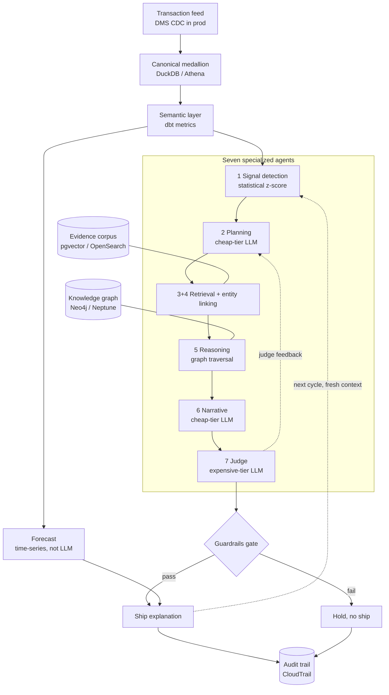

# Architecture

One page. The data-to-decision flow, the two Ralph feedback loops, and the
local-to-AWS mapping. The Mermaid renders in GitHub and most viewers. An ASCII version
follows for anywhere it does not.

## Data-to-decision flow



The two dotted arrows are the runtime Ralph loop: judge outcomes bias future planning,
and each cycle restarts detection with fresh context.

## ASCII fallback

```
  Transaction feed  (DMS CDC -> S3 in production)
        |
        v
  Canonical medallion   bronze -> silver -> gold        [DuckDB / Athena]
        |
        v
  Semantic layer        one governed metric definition  [dbt]
        |
        v
  +===================== SEVEN AGENTS =====================+
  | 1 Signal detection   statistical z-score trigger      |
  |        v                                               |
  | 2 Planning           cheap LLM picks path             |
  |        v                                               |
  | 3+4 Retrieval+link   evidence  <---[pgvector/OpenSearch]
  |        v                                               |
  | 5 Reasoning          graph traversal <---[Neo4j/Neptune]
  |        v                                               |
  | 6 Narrative          cheap LLM drafts + cites         |
  |        v                                               |
  | 7 Judge              expensive LLM verifies           |
  +=======================================================+
        |
        v
   Guardrails gate ---- fail ----> HOLD (no ship) --> Audit
        |
       pass
        |
        v      Forecast (time-series, separate from LLM)
   Ship explanation  <----------------------+
        |
        v
   Audit trail  (CloudTrail + CloudWatch)

  Ralph runtime loop:  judge feedback -> planning
                       ship/cycle end -> re-detect with fresh context
```

## Local-to-AWS stack (the single flip)

```
  LAYER          LOCAL STAND-IN (free)          AWS (production)
  -----          --------------------           ----------------
  Query          DuckDB                         Athena over Parquet in S3
  Semantic       dbt-duckdb                     dbt Core on ECS
  Graph          Neo4j Community / networkx     Neptune
  Retrieval      pgvector / in-memory           OpenSearch Serverless / Bedrock KB
  LLM            Ollama two-tier                Bedrock  Claude Haiku + Sonnet
  Orchestration  LangGraph / explicit sequence  Step Functions
  Forecast       seasonal-naive-drift           SageMaker or Lambda
  Guardrails     policy check                   Bedrock Guardrails
  Audit          append-only log                CloudTrail + CloudWatch
  Ralph runtime  Prefect / bounded loop         EventBridge Scheduler + Step Functions
```

Nothing in the application code names a vendor. `fsbi/config.py` reads `LLM_BACKEND` and
`GRAPH_BACKEND`. Changing those two values moves each layer from the local column to the
AWS column with no code change.
```
